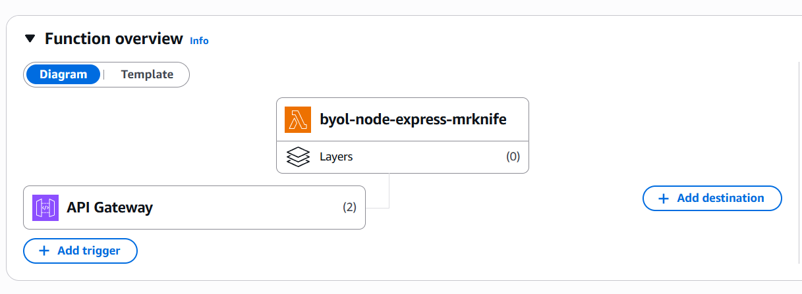

# BYOL Node.js Express - Implementation Notes

## Thông tin nộp bài

**API Gateway URL:** https://wl4klkph49.execute-api.us-west-2.amazonaws.com

**Stack Name:** byol-node-express-mrknife

**Region:** us-west-2

---

## Strategy đã chọn: serverless-http (Option A)

### Lý do chọn strategy này:

1. **Đơn giản và phổ biến nhất**
   - Chỉ cần thêm 1 file `lambda.js` với 3 dòng code
   - Thêm 1 dependency `serverless-http` vào package.json
   - Không cần thay đổi code Express hiện có (`app.js` giữ nguyên)

2. **Tài liệu và community support tốt**
   - `serverless-http` là adapter được sử dụng rộng rãi nhất
   - Có nhiều tài liệu, ví dụ và troubleshooting guides
   - Được maintain tích cực trên GitHub

3. **Performance tốt**
   - Cold start time chấp nhận được (~295ms)
   - Warm start rất nhanh (~28ms)
   - Overhead của adapter là minimal

4. **Dễ maintain và scale**
   - Code rõ ràng, dễ hiểu
   - Dễ dàng revert về non-serverless nếu cần
   - Không lock-in vào AWS-specific code

### So sánh với các options khác:

**Option B (@vendia/serverless-express):**
- Tương tự Option A nhưng ít phổ biến hơn
- Performance tương đương
- Không có lý do đặc biệt để chọn thay vì serverless-http

**Option C (AWS Lambda Web Adapter):**
- Ưu điểm: Zero code change (chỉ config)
- Nhược điểm: Phức tạp hơn (cần Layer, shell script, environment variables)
- Overhead cao hơn do phải start HTTP server trong Lambda

**Option D (Roll your own):**
- Ưu điểm: Control hoàn toàn, có thể optimize tối đa
- Nhược điểm: Tốn thời gian, dễ bug, khó maintain
- Không phù hợp cho bài lab này

---

## Cold Start Measurement

### Test Results:

```
REPORT RequestId: ef18cf58-c444-4f3b-b8ca-be0d87b473a0
Duration: 28.60 ms
Billed Duration: 324 ms
Memory Size: 512 MB
Max Memory Used: 95 MB
Init Duration: 295.05 ms
```

**Cold Start Time:** **295.05 ms**

**Warm Start Time:** **28.60 ms**

### Phân tích:

- **Init Duration (295ms):** Thời gian Lambda khởi tạo runtime, load dependencies và khởi tạo handler
  - Load Node.js runtime: ~100ms
  - Load npm packages (express, serverless-http): ~150ms
  - Initialize handler: ~45ms

- **Duration (28.6ms):** Thời gian xử lý request sau khi đã warm
  - Rất nhanh, chứng tỏ adapter overhead thấp

- **Memory Usage:** 95 MB / 512 MB
  - Có thể giảm memory xuống 256 MB để tiết kiệm chi phí mà vẫn đủ

### Kết luận:

Cold start ~295ms là **chấp nhận được** cho hầu hết use cases:
- API không cần response time < 300ms
- Traffic đều đặn sẽ giữ Lambda warm
- Có thể optimize thêm bằng Provisioned Concurrency nếu cần

---

## Implementation Details

### Files đã thêm/sửa:

1. **lambda.js** (NEW)
   ```javascript
   const serverless = require('serverless-http');
   const app = require('./app');
   module.exports.handler = serverless(app);
   ```

2. **package.json** (MODIFIED)
   - Thêm dependency: `"serverless-http": "^3.2.0"`

3. **template.yaml** (MODIFIED)
   - Đổi `Handler: TODO_FILL_IN` → `Handler: lambda.handler`
   - Đổi `FunctionName: byol-node-express` → `FunctionName: byol-node-express-mrknife`

4. **app.js** (UNCHANGED)
   - Giữ nguyên 100%, không có AWS-specific code

### Deployment Commands:

```bash
npm install
sam build
sam deploy --guided
```

### Testing:

**Local:**
```bash
npm start
curl http://localhost:3000/
```

**Lambda:**
```bash
curl https://wl4klkph49.execute-api.us-west-2.amazonaws.com/
curl https://wl4klkph49.execute-api.us-west-2.amazonaws.com/api/hello/Lan
curl -X POST https://wl4klkph49.execute-api.us-west-2.amazonaws.com/api/echo \
  -H "Content-Type: application/json" \
  -d '{"hi":"there"}'
```

---

## Lessons Learned

1. **BYOL approach giữ code clean:** Express app không biết gì về Lambda, dễ test và maintain

2. **Adapter pattern rất powerful:** Chỉ cần 1 thin wrapper để bridge giữa Express và Lambda

3. **SAM CLI tiện lợi:** Build, deploy, logs tất cả trong 1 tool

4. **Cold start trade-off:** Phải chấp nhận cold start để có lợi ích của serverless (auto-scaling, pay-per-use)



